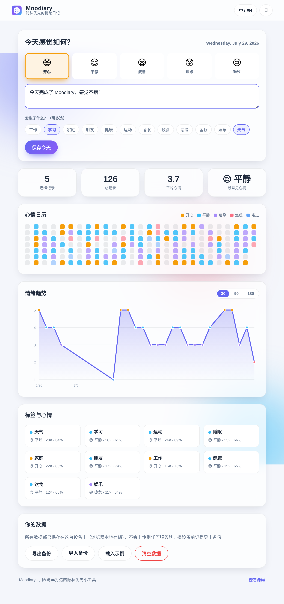
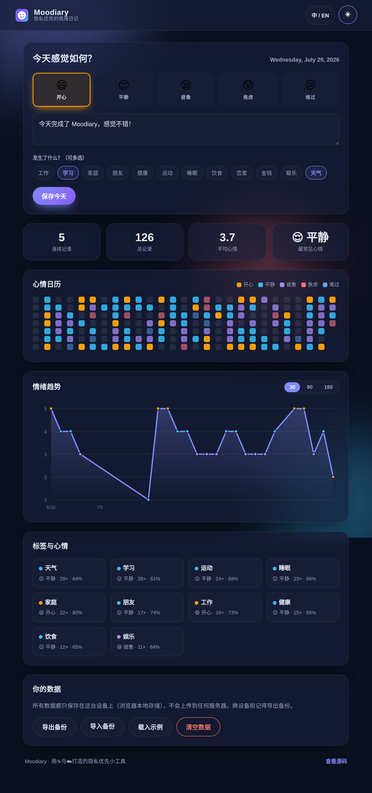

<p align="center">
  
</p>

<h1 align="center">Moodiary</h1>

<p align="center">
  <b>隐私优先的情绪日记</b> · A privacy-first mood diary
</p>

<p align="center">
  纯前端 · 零依赖 · 可离线安装 · 数据只属于你<br/>
  <i>Vanilla JS · Zero dependencies · Installable PWA · Your data stays on your device</i>
</p>

<p align="center">
  <a href="https://github.com/mornrain-lin/Moodiary">🌐 Live Demo</a> ·
  <a href="https://github.com/mornrain-lin/Moodiary#-快速开始">🚀 快速开始</a> ·
  <a href="https://github.com/mornrain-lin/Moodiary/blob/main/LICENSE">MIT License</a>
</p>

---

## ✨ 功能 Features

- 🌈 **每天记录心情** —— 5 种情绪（开心 / 平静 / 疲惫 / 焦虑 / 难过），一键点选
- 📝 **随手写几句** —— 可选的心情备注，最多 280 字
- 🏷️ **场景标签** —— 工作、学习、家庭、健康… 看清什么在影响你的情绪
- 📅 **心情日历** —— GitHub 风格热力图，一眼看见情绪起伏
- 📈 **情绪趋势** —— 手写 SVG 折线图，支持 30 / 90 / 180 天
- 🧩 **标签统计** —— 每个场景下的平均心情与高频情绪
- 🌗 **深色模式** —— 跟随系统，也可手动切换
- 🌍 **中英双语** —— 一键切换 Language
- 💾 **数据自主** —— 仅存于本地 `localStorage`，支持导出 / 导入 JSON 备份
- 📲 **可安装 PWA** —— 添加到主屏，离线也能用
- 🪶 **零依赖** —— 没有框架、没有构建步骤，打开即用的静态站点

## 🖼️ 截图 Screenshots

| 浅色模式 Light | 深色模式 Dark |
| --- | --- |
|  |  |

> 日历热力图与情绪趋势图均为**零依赖手写 SVG**，无任何图表库。

## 🔒 隐私 Privacy

> **你的情绪只属于你。**

Moodiary **没有任何后端、没有任何网络请求、不收集任何数据**。所有记录都保存在你当前浏览器的 `localStorage` 中。换设备前，用「导出备份」把数据带走即可（标准 JSON，可被人读、可被其他程序复用）。

## 🚀 快速开始 Quick start

### 方式一：直接部署到 GitHub Pages（推荐）

1. 点击右上角 **Fork** 或把本仓库克隆到你的账号
2. 进入仓库 **Settings → Pages**，Source 选择 `main` 分支、`/ (root)`
3. 几秒后访问 `https://mornrain-lin.github.io/Moodiary` 即可使用

### 方式二：本地运行

```bash
# 任意静态服务器均可，例如：
python3 -m http.server 8080
# 然后打开 http://localhost:8080
```

> 因为使用了 ES Modules，请通过 `http://` 访问，不要直接双击 `index.html`（`file://` 会被浏览器拦截）。

## 🛠️ 技术栈 Tech stack

- 纯 **HTML + CSS + 原生 JavaScript（ES Modules）**
- 零第三方依赖、零构建步骤
- 图表：手写 **SVG**（日历热力图 / 趋势折线图）
- 存储：`localStorage`
- 离线：原生 **Service Worker + Web App Manifest**

## 📁 目录结构 Structure

```
Moodiary/
├── index.html                  # 页面骨架
├── assets/
│   ├── css/style.css           # 主题 / 布局 / 动效
│   ├── js/
│   │   ├── app.js              # 主逻辑
│   │   ├── i18n.js             # 国际化与情绪定义
│   │   ├── store.js            # 数据层与统计
│   │   └── charts.js           # 零依赖 SVG 图表
│   ├── sw.js                   # Service Worker
│   ├── manifest.webmanifest    # PWA 清单
│   └── icons/                  # 应用图标
├── LICENSE
└── README.md
```

## 🤝 贡献 Contributing

欢迎 PR！无论是新情绪、新语言、还是更好的可视化，都很有价值。

```bash
git clone https://github.com/mornrain-lin/Moodiary.git
cd Moodiary
python3 -m http.server 8080
```

## 📜 许可证 License

[MIT](LICENSE) © Moodiary contributors
